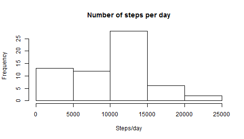
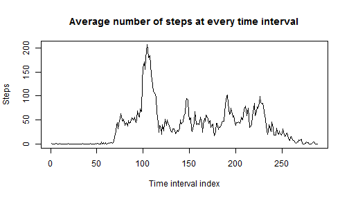
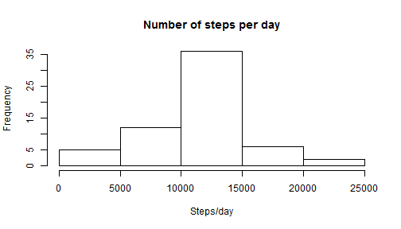
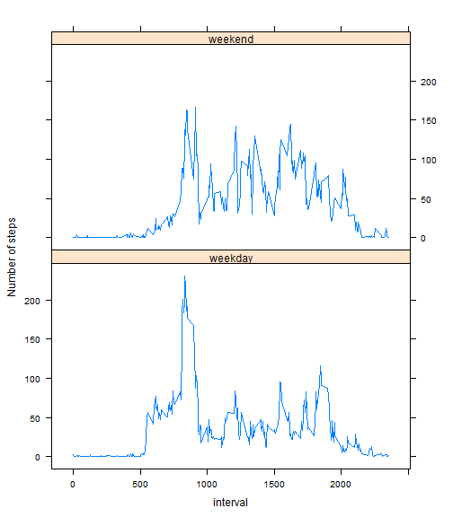

# Reproducible Research: Peer Assessment 1

## Unpacking, Loading and preprocessing the data

```r
unzip("activity.zip")
data <- read.csv("./activity.csv")
```

## Calculate average number of steps made per day

```r
stepsperday <- tapply(as.numeric(data$steps), data$date, sum, na.rm = TRUE)
```

## What is mean total number of steps taken per day?

```r
hist(stepsperday, main = "Number of steps per day", xlab = "Steps/day")
```

 

```r
med <- median(stepsperday)
mea <- mean(stepsperday)
```

The median total number steps per day is 1.0395 &times; 10<sup>4</sup>
The mean total number steps per day is 9354.2295

## What is the average daily activity pattern?
Average steps over time intervals, and plot the pattern


```r
stepsperinterval <- tapply(as.numeric(data$steps), data$interval, mean, na.rm = TRUE)
plot(stepsperinterval, main = "Average number of steps at every time interval", 
    xlab = "Time interval index", ylab = "Steps", type = "l")
```

 

5-minute interval, which contains the maximum number of steps is 104

## Imputing missing values
Calculating the total number of missing days:

```r
wherena <- is.na(data$steps)  # Find NA-observations
```

The total number is 2304

Since there is no data for the whole first day, the day averaging approach for the imputing is not possible. Thus we shall stick to the interval average approach

```r
data2 <- data  # copy the data 
data2[wherena, ]$steps <- sapply(data[wherena, ]$interval, function(x) stepsperinterval[[as.character(x)]])  # impute data
```

Once the data is imputed, we can recalculate the histogram, mean and median values:

```r
stepsperday2 <- tapply(as.numeric(data2$steps), data2$date, sum, na.rm = TRUE)
hist(stepsperday2, main = "Number of steps per day", xlab = "Steps/day")
```

 

```r
med <- median(stepsperday2)
mea <- mean(stepsperday2)
```

As one can see, the fraction of 0-values gets smaller, since it was tranferred to mean values reagion, which gets higher.
The **median** total number steps per day is 1.0766 &times; 10<sup>4</sup>
The **mean** total number steps per day is 1.0766 &times; 10<sup>4</sup>

## Are there differences in activity patterns between weekdays and weekends?

Let's first define the function which convert the date to POSIX format, detect the day of the week, and returns the 'weekend' or 'weekday' string as output. 

```r
weekday <- function(x) {
    day <- as.POSIXlt(x)$wday
    if (day == 0 | day == 6) {
        "weekend"
    } else {
        "weekday"
    }
}
```


Create a new factor variable:

```r
data2$wday <- sapply(data2$date, weekday)  #new string variable
data2$wday <- as.factor(data2$wday)  # convert to factor
```


Average steps over intervals with respect to the weekday:

```r
data2_bywday_interval <- aggregate(data2$steps, by = list(data2$wday, data2$interval), 
    mean)
names(data2_bywday_interval) <- c("wday", "interval", "steps")
```


Plot the patterns

```r
library(lattice)
xyplot(steps ~ interval | wday, data = data2_bywday_interval, layout = c(1, 
    2), type = "l", ylab = "Number of steps")
```

 

